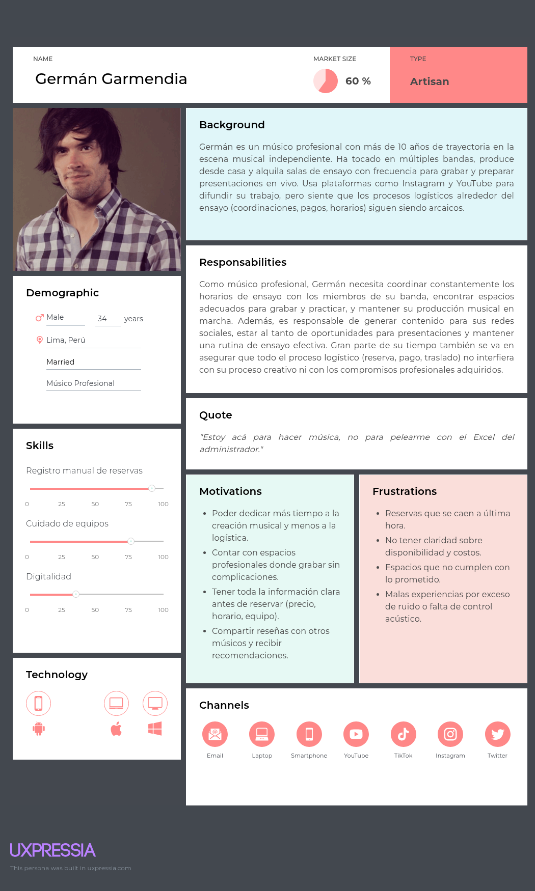

# Universidad Peruana de Ciencias Aplicadas

Ingeniería de software

Ciclo 2025-01

**Sección:**

**Profesor:** Bautista Ubillús, Efraín Ricardo

**Nombre del StartUp:**

**Nombre del Producto:**

| Miembro             			       |   Código   |
|------------------------------------------|------------|
| Hernández Uchuya María Patricia		 | U202311258 |
| Millones Espinoza, Jesús Andrés 		 | U20211B598 |
| Mondoñedo Rodriguez, Juan Diego Javier   | U202110373 |
| Julca Cruz, Renso Anthony 			 | U202121579 |
| Cacho Seminario, Diego Alonso 		 | U202223990 |

**Ciclo 2025-01**

# Registro de Versiones del Informe

| Version | Fecha      | Autor                                         | Descripción de modificación                                                                                           |
| ------- |------------|-----------------------------------------------|-----------------------------------------------------------------------------------------------------------------------|
| 1.0     | 05/04/2025 | Castro, Hernández, Millones, Mondoñedo, Julca | Creación del documento de trabajo en formato markdown                                                                 |
| 1.1     | 06/042025  | Millones                                      | Redacción de la descripción del startup, Business Assumptions, Feature Assumptions                                    |
| 1.2     | 06/04/2025 | Hernández                                     | Redacción de antecedentes y problemática, Lean UX Problem Statements, User Assumptions, Lean UX Hypothesis Statements |
| 1.3     |            |                                               |                                                                                                                       |
| 1.4     |            |                                               |                                                                                                                       |
| 1.5     |            |                                               |                                                                                                                       |
| 1.6     |            |                                               |                                                                                                                       |
| 1.7     |            |                                               |                                                                                                                       |
| 1.8     |            |                                               |                                                                                                                       |

# Project Report Collaboration Insights

URL del repositorio para el proyecto: https://github.com/BeatSoundLabs-BSL

**TB1**

Para el desarrollo del informe perteneciente a la entrega TB1, se dividió la implementación de secciones de la siguiente forma
para cada integrante del equipo:

| Integrantes     | Tareas Asignadas |
|-----------------| ---------------- |
| Maria Hernandez |                  |
| Jesus Millones  |                  |
| Juan Mondoñedo  |                  |
| Renso Julca     |                  |
| Diego Cacho     |                  |

# Project Report Collaboration Insights
**Github Collaboration Insights**

Github también presenta un timeline de las ramas principales y los procesos de merge a los que se han sometido. Todas las
ramas se crearon tomando en cuenta el diseño de GitFlow para una buena organización cuando se usa un software de control
de versiones.

Los integrantes son:

- Maria Hernandez
- Jesus Millones - (JJSON-11110)
- Juan Mondoñedo
- Renso Julca - (rajc02)
- Diego Cacho - (Memesitos)

Se explican las ramas más prominentes:

**<code>main</code>:** Es representada por el color negro. Se trata de la rama principal del proyecto y se actualiza para cada entregable. 
**<code>develop</code>:** Es representada por el color azul. Se trata de la rama principal para el proceso del desarrollo del proyecto. 
**<code>feature/feature-name</code>:** Es representada por el color verde. Se utiliza para el desarrollo de nuevas funcionalidades específicas del proyecto.

# Contenido

1. [Capítulo I: Introducción](#capítulo-i-introducción) 
   1.1. [Startup Profile](#11-startup-profile) 
   1.1.1. [Descripción de la Startup](#111-descripción-de-la-startup) 
   1.1.2. [Perfiles de integrantes del equipo](#112-perfiles-de-integrantes-del-equipo) 
   1.2. [Solution Profile](#12-solution-profile) 
   1.2.1 [Antecedentes y problemática](#121-antecedentes-y-problemática) 
   1.2.2 [Lean UX Process](#122-lean-ux-process) 
   1.2.2.1. [Lean UX Problem Statements](#1221-lean-ux-problem-statements) 
   1.2.2.2. [Lean UX Assumptions](#1222-lean-ux-assumptions) 
   1.2.2.3. [Lean UX Hypothesis Statements](#1223-lean-ux-hypothesis-statements) 
   1.2.2.4. [Lean UX Canvas](#1224-lean-ux-canvas) 
   1.3. [Segmentos objetivo](#13-segmentos-objetivo) 
2. [Capítulo II: Requirements Elicitation & Analysis](#capítulo-ii-requirements-elicitation--analysis) 
   2.1. [Competidores](#21-competidores) 
   2.1.1. [Análisis competitivo](#211-análisis-competitivo) 
   2.1.2. [Estrategias y tácticas frente a competidores](#212-estrategias-y-tácticas-frente-a-competidores) 
   2.2. [Entrevistas](#22-entrevistas) 
   2.2.1. [Diseño de entrevistas](#221-diseño-de-entrevistas) 
   2.2.2. [Registro de entrevistas](#222-registro-de-entrevistas) 
   2.2.3. [Análisis de entrevistas](#223-análisis-de-entrevistas) 
   2.3. [Needfinding](#23-needfinding) 
   2.3.1. [User Personas](#231-user-personas) 
   2.3.2. [User Task Matrix](#232-user-task-matrix) 
   2.3.3. [User Journey Mapping](#232-user-task-matrix) 
   2.3.4. [Empathy Mapping](#234-empathy-mapping) 
   2.3.5. [As-is Scenario Mapping](#235-as-is-scenario-mapping) 
   2.4. [Ubiquitous Language](#24-ubiquitous-language) 
3. [Capítulo III: Requirements Specification](#capítulo-iii-requirements-specification) 
   3.1. [To-Be Scenario Mapping](#31-to-be-scenario-mapping) 
   3.2. [User Stories](#32-user-stories) 
   3.3. [Impact Mapping](#33-impact-mapping) 
   3.4. [Product Backlog](#34-product-backlog) 
4. [Capítulo IV: Product Design](#capítulo-iv-product-design) 
   4.1. [Style Guidelines](#41-style-guidelines) 
   4.1.1. [General Style Guidelines](#411-general-style-guidelines) 
   4.1.2. [Web Style Guidelines](#412-web-style-guidelines) 
   4.2. [Information Architecture](#42-information-architecture) 
   4.2.1. [Organization Systems](#421-organization-systems) 
   4.2.2. [Labeling Systems](#422-labeling-systems) 
   4.2.3. [SEO Tags and Meta Tags](#423-seo-tags-and-meta-tags) 
   4.2.4. [Searching Systems](#424-searching-systems) 
   4.2.5. [Navigation Systems](#425-navigation-systems) 
   4.3. [Landing Page UI Design](#43-landing-page-ui-design) 
   4.3.1. [Landing Page Wireframe](#431-landing-page-wireframe) 
   4.3.2. [Landing Page Mock-up](#432-landing-page-mock-up) 
   4.4. [Web Applications UX/UI Design](#44-web-applications-uxui-design) 
   4.4.1. [Web Applications Wireframes](#441-web-applications-wireframes) 
   4.4.2. [Web Applications Wireflow Diagrams](#442-web-applications-wireflow-diagrams) 
   4.4.2. [Web Applications Mock-ups](#442-web-applications-mock-ups) 
   4.4.3. [Web Applications User Flow Diagrams](#443-web-applications-user-flow-diagrams) 
   4.5. [Web Applications Prototyping](#45-web-applications-prototyping) 
   4.6. [Domain-Driven Software Architecture](#46-domain-driven-software-architecture) 
   4.6.1. [Software Architecture Context Diagram](#461-software-architecture-context-diagram) 
   4.6.2. [Software Architecture Container Diagrams](#462-software-architecture-container-diagrams) 
   4.6.3. [Software Architecture Components Diagrams](#463-software-architecture-components-diagrams) 
   4.7. [Software Object-Oriented Design](#47-software-object-oriented-design) 
   4.7.1. [Class Diagrams](#471-class-diagrams) 
   4.7.2. [Class Dictionary](#472-class-dictionary) 
   4.8. [Database Design](#48-database-design) 
   4.8.1. [Database Diagram](#481-database-diagram) 
5. [Capítulo V: Product Implementation, Validation & Deployment](#capítulo-v-product-implementation-validation--deployment) 
   5.1. [Software Configuration Management](#51-software-configuration-management) 
   5.1.1. [Software Development Environment Configuration](#511-software-development-environment-configuration) 
   5.1.2. [Source Code Management](#512-source-code-management) 
   5.1.3. [Source Code Style Guide & Conventions](#513-source-code-style-guide--conventions) 
   5.1.4. [Software Deployment Configuration](#514-software-deployment-configuration) 
   5.2. [Landing Page, Services & Applications Implementation](#52-landing-page-services--applications-implementation) 
   5.2.1. [Sprint 1](#521-sprint-1) 
   5.2.1.1. [Sprint Planning 1](#5211-sprint-planning-1) 
   5.2.1.2. [Aspect Leaders and Collaborators](#5212-aspect-leaders-and-collaborators) 
   5.2.1.3. [Sprint Backlog 1](#5213-sprint-backlog-1) 
   5.2.1.4. [Development Evidence for Sprint Review](#5214-development-evidence-for-sprint-review) 
   5.2.1.5. [Execution Evidence for Sprint Review](#5215-execution-evidence-for-sprint-review) 
   5.2.1.6. [Services Documentation Evidence for Sprint Review](#5216-services-documentation-evidence-for-sprint-review) 
   5.2.1.7. [Software Deployment Evidence for Sprint Review](#5217-software-deployment-evidence-for-sprint-review) 
   5.2.1.8. [Team Collaboration Insights during Sprint](#5218-team-collaboration-insights-during-sprint) 

6. [Conclusiones](#conclusiones) 
   6.1 [Conclusiones y recomendaciones](#61-conclusiones-y-recomendaciones) 
7. [Bibliografía](#bibliografía) 
8. [Anexos](#anexos) 

# Student Outcomes
**Student Outcome 3**

| Criterio específico                                                | Acciones realizadas                                                                            | Conclusiones |
|--------------------------------------------------------------------|------------------------------------------------------------------------------------------------|--------------|
| Comunica oralmente con efectividad a diferentes rangos de audiencia. | Maria Hernandez:  Jesus Millones:  Juan Mondoñedo:  Renso Julca:  Diego Cacho:  |              |
| Comunica por escrito con efectividad a diferentes rangos de audiencia | Maria Hernandez:  Jesus Millones:  Juan Mondoñedo:  Renso Julca:  Diego Cacho:  |              |

# Capítulo I: Introducción

## 1.1. Startup Profile
En esta sección se presenta la descripción del startup y los perfiles de los miembros del equipo.

### 1.1.1. Descripción de la Startup

Nuestra startup, “BeatSoundLabs” (abreviando BSL), propone una solución tecnológica cuyo objetivo es digitalizar el alquiler y uso de salas de ensayo y estudios musicales, promoviendo un buen uso de estos espacios al igual que simplificando procesos para los músicos y administradores de estas áreas.  A través de nuestra plataforma digital “SoundNest”, los administradores podrán manejar sus reservas, horarios y pagos.  Por otro lado, los músicos serán capaces de reservar dichos espacios de manera automatizada y remota. Esta plataforma también tendrá funcionalidades para el monitoreo de niveles sonoros en tiempo real. Esto con el fin de mantener el cumplimiento de normativas acústicas de cada espacio y promover un entorno de respeto dentro de los estudios que formen parte de la plataforma. La solución está pensada para beneficiar tanto a pequeños espacios como a centros y estudios musicales profesionales.  Además, se contemplan proyecciones a largo plazo para integrar tecnologías IoT dedicadas a nuevas funcionalidades tales como la automatización de accesos,  iluminación y control ambiental de los recintos.
**Misión:** Digitalizar y optimizar el acceso a salas de ensayo y estudios musicales mediante tecnología innovadora simplificando procesos de reserva, gestión y control acústico para músicos y administradores.
**Visión:** Ser la solución tecnológica preferida por músicos y gestores de espacios musicales en Perú, siendo reconocidos por nuestra capacidad de innovación constante y por transformar la experiencia de uso de salas de ensayo y estudios de grabación.

### 1.1.2. Perfiles de integrantes del equipo
| **Perfil**                                     | **Foto**                                                                       |
|------------------------------------------------|--------------------------------------------------------------------------------|
| **Hernández Uchuya María Patricia**         |   |
| **Millones Espinoza, Jesús Andrés**  Estudiante en Ingeniería de Software en la UPC. Me considero una persona puntual, orientada a encontrar soluciones rápidas y lógicas frente a los problemas. Tengo experiencia con el sistema operativo Linux y el lenguaje de programación Java.       |   |
| **Mondoñedo Rodriguez, Juan Diego Javier**  |   |
| **Julca Cruz, Renso Anthony**  Estudiante de Ingenieria de Software, actualmente curso el 5to ciclo de esta carrera. Me apasiona programar y ser autodidacta para poder mejorar mis habilidades en el desarrollo de software, quisiera dedicarme a la parte de gestion bancaria.             |    
| **Cacho Seminario, Diego Alonso** Soy estudiante de Ingeniería de Software cursando el 6to ciclo de mi carrera en la UPC y tengo 20 años. Me considero una persona tranquila y diligente, intentó realizar mis tareas y trabajos lo antes posible para evitar contratiempos en un futuro, especialmente si son actividades que consumen mucho tiempo. Como miembro de equipo buscaré ayudar a mis compañeros cuando lo necesiten, realizando además mis entregas lo más temprano posible. Habilidades en C++, C#, Python, Unity 2D/3D, html/css/js.          |  |

## 1.2. Solution Profile

### 1.2.1 Antecedentes y problemática

**What (Qué)**
¿Cuál es el problema?

El problema principal es la falta de digitalización en el alquiler y gestión de salas de ensayo y estudios musicales en el Perú, lo que genera ineficiencias como dobles reservas, pagos no registrados y falta de control acústico. Esto dificulta el acceso ordenado para músicos y complica la administración de estos espacios.

**When (Cuándo)**
¿Cuándo sucede el problema?

El problema se manifiesta cuando los músicos y administradores de salas de ensayo intentan coordinar reservas, pagos y control acústico mediante métodos tradicionales, generando ineficiencias, conflictos y pérdida de tiempo en un mercado que demanda soluciones digitales ágiles y confiables.

**Where (Dónde)**
¿A dónde se dirige? ¿Dónde surge el problema?

El problema surge en salas de ensayo y estudios musicales en el Perú, especialmente en aquellos que operan con métodos tradicionales. La solución se dirige a estos espacios, desde pequeños locales hasta estudios profesionales.

**Who (Quién)**
¿Quiénes están involucrados? ¿Quién lo utilizará?

Los involucrados son administradores de estudios, músicos emergentes y profesionales. La plataforma será utilizada por ambos grupos para agilizar reservas, pagos y monitoreo acústico.

**Why (Por qué)**
¿Cuál es la causa del problema?

La causa del problema es la falta de herramientas tecnológicas adaptadas al sector, lo que lleva a procesos manuales, errores humanos y falta de estandarización en la gestión de espacios musicales.

**How (Cómo)**
¿Cómo se utilizará el producto?

El producto se utilizará mediante una plataforma digital que permitirá reservas automatizadas, gestión de pagos y monitoreo de niveles sonoros en tiempo real, facilitando tanto la administración como el acceso a los espacios.

**How much (Cuánto)**
¿Cuál es la magnitud del problema?

Según estudios, la industria musical independiente ha crecido, pero el 78% de los músicos reportan dificultades para acceder a las salas de ensayo por falta de organización (UPC, 2022). Además el 65% de los administradores enfrentan conflictos por ruido debido a la falta de control acústico (Larrosa Music Group, 2023).

### 1.2.2 Lean UX Process

El proceso Lean UX se centra en la validación rápida de ideas y en la colaboración constante con los usuarios para desarrollar productos que realmente satisfagan sus necesidades.

#### 1.2.2.1. Lean UX Problem Statements

BeatSoundLabs es una startup que busca revolucionar el acceso y la gestión de salas de ensayo y estudios musicales en el Perú mediante SoundNest, una plataforma digital que automatiza reservas, pagos y monitoreo acústico. Nuestra solución está diseñada para optimizar la experiencia tanto de músicos como de administradores, promoviendo un uso eficiente y ordenado de estos espacios.

Hemos observado un factor crítico que afecta a músicos y administradores, y es la dependencia de métodos manuales para gestionar reservas y controlar niveles de ruido genera ineficiencias, conflictos y pérdida de oportunidades. Los músicos enfrentan dificultades para acceder a espacios de manera ágil, mientras que los administradores lidian con problemas operativos como dobles reservas, pagos no registrados y quejas por exceso de ruido, lo que limita el crecimiento de la industria musical local.

¿Cómo podríamos optimizar la gestión y el acceso a salas de ensayo y estudios musicales, eliminando las barreras de los procesos manuales y garantizando un uso eficiente, transparente y acústicamente responsable de estos espacios?

#### 1.2.2.2. Lean UX Assumptions
Business Assumptions:
1. **Los administradores de salas de ensayo** y estudios de grabación están dispuestos a adoptar una plataforma digital que facilite la gestión de sus operaciones.
2. **Los administradores de salas de ensayos** desean herramientas digitales que les permitan simplificar la gestión de sus espacios sin requerir conocimientos técnicos avanzados.
3. **Los administradores de salas de ensayo** desean herramientas digitales que les permitan automatizar y simplificar la gestión de sus espacios sin requerir conocimientos técnicos avanzados.
4. **Los administradores de salas de ensayo** estarían dispuestos a invertir en herramientas que eviten sanciones o cierres, ya que existe una necesidad de monitoreo sonoro en tiempo real debido a restricciones municipales o quejas frecuentes de vecinos, 
5. **Los músicos** valorarán y harán uso de una solución que les permita reservar espacios de ensayo y grabación de manera remota y automatizada.
6. **Los músicos** valoran poder conocer la disponibilidad, precios y características de un espacio en tiempo real antes de reservar, especialmente cuando ensayan en diferentes distritos o ciudades.
7. **La integración de funcionalidades** de monitoreo en tiempo real ayudará a los estudios de grabación a cumplir con las normativas acústicas y reducirá conflictos con comunidades cercanas.
8. **La implementación con tecnologías IoT** para la automatización de accesos, iluminación y control ambiental mejorará la experiencia de administradores y músicos.
User Assumptions:
+ ¿Quién es el usuario?
Nuestros usuarios principales son músicos que necesitan alquilar salas de ensayo o estudios de grabación con facilidad, y administradores de estos espacios que buscan optimizar la gestión de reservas, pagos y control acústico.

+ ¿Dónde encaja nuestro producto en su trabajo o vida?
SoundNest se integra en la rutina de los músicos al agilizar la búsqueda y reserva de espacios, mientras que para los administradores funciona como una herramienta centralizada de gestión, reemplazando métodos manuales y reduciendo errores operativos.

+ ¿Qué problemas tiene nuestro producto? ¿Resolver?
Elimina la desorganización en reservas, evita conflictos por pagos no registrados o reservas dobles, y reduce quejas por exceso de ruido mediante monitoreo acústico en tiempo real, mejorando la experiencia tanto para músicos como para dueños de estudios.

+ ¿Cuándo y cómo es nuestro producto? ¿Usado?
Los músicos lo usan cuando necesitan reservar un espacio desde cualquier dispositivo, mientras que los administradores lo utilizan diariamente para gestionar horarios, pagos y recibir alertas acústicas, todo en una plataforma accesible desde web o móvil.

+ ¿Qué características son importantes?
Las características más resaltantes son las reservas automatizadas con disponibilidad en tiempo real, un sistema de pagos integrado el cual es transparente y seguro, monitoreo acústico con alertas, y sobre todo una interfaz intuitiva para ambos tipos de usuarios.

+ ¿Cómo debe verse nuestro producto y cómo debe comportarse?
El producto debe presentar una interfaz limpia, intuitiva y visualmente atractiva, diseñada para facilitar la interacción tanto de músicos como de administradores. Debe priorizar la velocidad de respuesta y la claridad en la visualización de espacios disponibles, horarios y datos acústicos. Su comportamiento debe ser confiable, con notificaciones en tiempo real y un sistema seguro que proteja la información de pagos y reservas, garantizando una experiencia fluida y profesional para todos los usuarios.

Feature Assumptions:
+ **Creemos que** al proporcionar a los administradores una plataforma digital para gestionar reservas, horarios y pagos, mejoraremos la eficiencia operativa y reduciremos errores en la gestión de sus espacios.
+ **Creemos que** al ofrecer a los músicos una aplicación que les permita reservar espacios de ensayo y grabación de forma remota y automatizada, aumentaremos la satisfacción del usuario y la frecuencia de uso de los espacios.
+ **Creemos que** al integrar monitoreo de niveles sonoros en tiempo real, ayudaremos a los estudios a cumplir con las normativas acústicas y reduciremos las quejas de las comunidades vecinas.
+ **Creemos que** al incorporar tecnologías IoT para la automatización de accesos, iluminación y control ambiental, mejoraremos la experiencia del usuario y optimizaremos el uso de recursos en los espacios de ensayo y grabación.

#### 1.2.2.3. Lean UX Hypothesis Statements.
+ Hypothesis Statement 01:
**Creemos que** la automatización de reservas y pagos reducirá significativamente los conflictos por reservas dobles y pagos no registrados en los estudios musicales.
**Sabremos que hemos tenido éxito**
**Cuando** se reporte una disminución del 60% en disputas por reservas y un 80% de transacciones procesadas correctamente en los primeros tres meses del lanzamiento.
+ Hypothesis Statement 02:
**Creemos que** la transparencia en precios y disponibilidad incentivará a más músicos a utilizar salas de ensayo con mayor frecuencia.
**Sabremos que hemos tenido éxito**
**Cuando** el 65% de los músicos usuarios active notificaciones para nuevas disponibilidades y se observe un aumento del 40% en reservas recurrentes por usuario en seis meses después del lanzamiento.
+ Hypothesis Statement 03:
**Creemos que** la plataforma mejorará la eficiencia operativa de los administradores al centralizar la gestión de horarios, pagos y control acústico en un solo lugar.
**Sabremos que hemos tenido éxito**
**Cuando** los administradores reporten una reducción del 50% en el tiempo dedicado a la gestión manual de sus espacios, según una encuesta realizada después de cuatro meses de uso.
+ Hypothesis Statement 04:
**Creemos que** la implementación de un sistema de calificaciones y reseñas mejorará la calidad de los espacios musicales y la confianza de los usuarios.
**Sabremos que hemos tenido éxito**
**Cuando** el 85% de las reservas se realicen en espacios con al menos 4 estrellas de calificación y el 70% de los usuarios consulte las reseñas antes de reservar.

#### 1.2.2.4. Lean UX Canvas.

## 1.3. Segmentos objetivo.

# Capítulo II: Requirements Elicitation & Analysis

## 2.1. Competidores.

El análisis competitivo es una herramienta clave para la toma de decisiones estratégicas, ya que permite identificar oportunidades, amenazas y desarrollar ventajas competitivas sostenibles en el mercado. Su importancia radica en ayudar a las empresas a adaptarse a un entorno dinámico y a tomar decisiones fundamentadas. A continuación, se presenta la aplicación de esta herramienta en el desarrollo del proyecto y el análisis de los competidores.

### 2.1.1. Análisis competitivo.

<table>
  <tr>
    <th colspan="6">Competitive Analysis Landscape</th>
  </tr>
  <tr>
    <td colspan="1" align="center" rowspan="2">¿Por qué llevar a cabo este análisis?</td>
    <td colspan="5" align="center">¿Cómo identificar a nuestros principales competidores?</td>
  </tr>
  <tr>
    <td colspan="5"  align="center">------</td>
  </tr>
  <tr>
    <th colspan="2" align="center">Nombre y logo</th>
    <td colspan="1" align="center">
    
<b>SoundNest</b>

    
    </td>
    <td colspan="1" align="center">
    
<b>Pirate.com</b>

    
    </td>
    <td colspan="1" align="center">
    
<b>Roomband</b>

    
    </td>
    <td colspan="1" align="center">
    
<b>Jammed</b>

    
    </td>
  </tr>
  <tr>
    <th colspan="1" rowspan="2" align="center">Perfil</th>
    <td colspan="1" align="center" >Overview</td>
    <td colspan="1"></td>
    <td colspan="1"></td>
    <td colspan="1"></td>
    <td colspan="1"></td>
  </tr>
  <tr>
    <td colspan="1" align="center">Ventaja competitiva ¿Qué valor ofrece a los clientes?</td>
    <td colspan="1">
    <ul>
    <li></li>
    </ul>
    </td>
    <td colspan="1">
    <ul>
    <li></li>
    </ul>
    </td>
    <td colspan="1">
    <ul>
    <li></li>
    </ul>
    </td>
    <td colspan="1">
    <ul>
    <li></li>
    </ul>
    </td>
  </tr>
  <tr>
    <th colspan="1" align="center" rowspan="2">Perfil de marketing</th>
    <td colspan="1" align="center">Mercado objetivo</td>
    <td colspan="1">
    <ul>
    <li></li>
    </ul>
    </td>
    <td colspan="1">
    <ul>
    <li></li>
    </ul>
    </td>
    <td colspan="1">
    <ul>
    <li></li>
    </ul>
    </td>
    <td colspan="1">
    <ul>
    <li></li>
    </ul>
    </td>
  </tr>
  <tr>
    <td colspan="1" align="center">Estrategias de marketing</td>
    <td colspan="1">
    <ul>
    <li></li>
    </ul>
    </td>
    <td colspan="1">
    <ul>
    <li></li>
    </ul>
    </td>
    <td colspan="1">
    <ul>
    <li></li>
    </ul>
    </td>
    <td colspan="1">
    <ul>
    <li></li>
    </ul>
    </td>
  </tr>
  <tr>
    <th colspan="1" align="center" rowspan="3">Perfil del producto</th>
    <td colspan="1" align="center">Productos & Servicios</td>
    <td colspan="1">
    <ul>
    <li></li>
    </ul>
    </td>
    <td colspan="1">
    <ul>
    <li></li>
    </ul>
    </td>
    <td colspan="1">
    <ul>
    <li></li>
    </ul>
    </td>
    <td colspan="1">
    <ul>
    <li></li>
    </ul>
    </td>
  </tr>
  <tr>
    <td colspan="1" align="center">Precios y Costos</td>
    <td colspan="1">
    <ul>
    <li></li>
    </ul>
    </td>
    <td colspan="1">
    <ul>
    <li></li>
    </ul>
    </td>
    <td colspan="1">
    <ul>
    <li></li>
    </ul>
    </td>
    <td colspan="1">
    <ul>
    <li></li>
    </ul>
    </td>
  </tr>
  <tr>
    <td colspan="1" align="center">Canales de distribución (Web y/o Móvil)</td>
    <td colspan="1"></td>
    <td colspan="1"></td>
    <td colspan="1"></td>
  </tr>
  <tr>
    <th colspan="1" align="center" rowspan="4">Análisis SWOT</th>
    <td colspan="1" align="center">Fortalezas</td>
    <td colspan="1">
    <ul>
    <li></li>
    </ul>
    </td>
    <td colspan="1">
    <ul>
    <li></li>
    </ul>
    </td>
    <td colspan="1">
    <ul>
    <li></li>
    </ul>
    </td>
    <td colspan="1">
    <ul>
    <li></li>
    </ul>
    </td>
  </tr>
  <tr>
    <td colspan="1" align="center">Debilidades</td>
    <td colspan="1">
    <ul>
    <li></li>
    </ul>
    </td>
    <td colspan="1">
    <ul>
    <li></li>
    </ul>
    </td>
    <td colspan="1">
    <li></li>
    </td>
    <td colspan="1">
    <ul>
    <li></li>
    </ul>
    </td>
  </tr>
  <tr>
    <td colspan="1" align="center">Oportunidades</td>
    <td colspan="1">
    <ul>
    <li></li>
    </ul>
    </td>
    <td colspan="1">
    <ul>
    <li></li>
    </ul>
    </td>
    <td colspan="1">
    <ul>
    <li></li>
    </ul>
    </td>
    <td colspan="1">
    <ul>
    <li></li>
    </ul>
    </td>
  </tr>
  <tr>
    <td colspan="1" align="center">Amenazas</td>
    <td colspan="1">
    <ul>
    <li></li>
    </ul>
    </td>
    <td colspan="1">
    <ul>
    <li></li>
    </ul>
    </td>
    <td colspan="1">
    <ul>
    <li></li>
    </ul>
    </td>
    <td colspan="1">
    <ul>
    <li></li>
    </ul>
    </td>
  </tr>
</table>

### 2.1.2. Estrategias y tácticas frente a competidores.

## 2.2. Entrevistas.

### 2.2.1. Diseño de entrevistas.

#### Segmento Objetivo 1: Músicos Principiantes y Profesionales
1. ¿Cuántos años tienes y en qué distrito de Lima resides?
2. ¿Cuánto tiempo llevas tocando o componiendo música? ¿Es esta tu ocupación principal?
3. ¿Con qué frecuencia necesitas alquilar una sala de ensayo o estudio de grabación?
4. ¿Qué dispositivos digitales sueles usar para gestionar tus ensayos o grabaciones?
5. ¿Qué tipo de características consideras más importantes al elegir un espacio para ensayar o grabar? (Por ejemplo, precio, acústica, ubicación, equipo disponible)
6. ¿Cómo sueles gestionar tus reservas de salas de ensayo actualmente?
7. ¿Has utilizado alguna plataforma o app para reservar espacios de ensayo en el pasado? ¿Cuál fue tu experiencia?
8. ¿Cuáles son las principales frustraciones que experimentas al utilizar salas de ensayo o estudios musicales?
9. ¿Qué opinas sobre el monitoreo de niveles sonoros en tiempo real en los estudios de ensayo? ¿Te gustaría contar con esa función?
10. ¿En qué redes sociales o plataformas digitales te informas o interactúas más como músico?

#### Segmento Objetivo 2: Administradores de Salas de Ensayo y Estudios Musicales
1. ¿Cuántos años tienes y cuál es tu ocupación? ¿Trabajas exclusivamente en la gestión de espacios musicales o en otra actividad también?
2. ¿Cuántas salas de ensayo o estudios gestionas y cuántos usuarios suelen alquilar los espacios mensualmente?
3. ¿Qué tipo de herramientas digitales usas actualmente para gestionar las reservas, pagos y horarios de las salas?
4. ¿Cuáles son los mayores desafíos que enfrentas al administrar una sala de ensayo o estudio musical?
5. ¿Qué factores consideras más importantes al establecer tarifas y horarios para las salas de ensayo?
6. ¿Usas alguna plataforma online para promocionar tus espacios de ensayo? ¿Cómo gestionas la visibilidad de tu sala?
7. ¿Qué tan importante es para ti contar con un sistema automatizado para la gestión de reservas y pagos?
8. ¿Te gustaría tener la capacidad de monitorear los niveles sonoros de los usuarios en tus espacios? ¿Qué beneficios o inconvenientes ves en esta funcionalidad?
9. ¿Qué tipo de dispositivos o software utilizas para controlar los accesos y la seguridad en tus espacios de ensayo?
10. ¿Qué plataformas o redes sociales utilizas para comunicarte con tus clientes y promocionar tus servicios?

### 2.2.2. Registro de entrevistas.

**Segmento objetivo #1: Músicos Principiantes y Profesionales**
=======
# **COURSE PROJECT**

  

<strong>Universidad Peruana de Ciencias Aplicadas</strong>

<strong>Ingeniería de Software</strong> 
Desarrollo de Aplicaciones Open Source - ####  
<strong>Profesor:</strong> ##########################

<h2 align="center">INFORME</h2>

<h3 align="center">Startup: BeatSoundLabs</h3>

<strong>Producto: SoundNest</strong>

<h3 align="center">Team Members:</h3>

| **Member**              | **Code** |
| ----------------------------- | -------------- |
| Hernández Uchuya María Patricia		 | U202311258 |
| Millones Espinoza, Jesús Andrés 		 | U20211B598 |
| Mondoñedo Rodriguez, Juan Diego Javier   | U202110373 |
| Julca Cruz, Renso Anthony 			 | U202121579 |
| Cacho Seminario, Diego Alonso 		 | U202223990 |

<strong>Abril 2025</strong>

# Registro de Versiones del Informe

| **Versión**              | **Fecha** | **Autor** | **Descripción de modificación** |
| ------------------------ | ----------| ----------| ------------------------------- |
| 1.0 | 05/04/2025 | Castro, Hernández, Millones, Mondoñedo, Julca | Creación del documento de trabajo en formato markdown |
| 1.1 | 06/04/2025 | Millones | Redacción de la descripción del startup, Business Assumptions, Feature Assumptions |
| 1.2 | 06/04/2025 | Hernández | Redacción de antecedentes y problemática, Lean UX Problem Statements, User Assumptions, Lean UX Hypothesis Statements |

\#Project Report Collaboration Insights
\</div\>

\#Contenido

\#Student Outcomes

Contenido

[**Capítulo I: Introducción**](#capítulo-i:-introducción)

[1.1. Startup Profile](#1.1.-startup-profile)

[1.1.1. Descripción de la Startup](#1.1.1.-descripción-de-la-startup)

[1.1.2. Perfiles de integrantes del equipo](#1.1.2.-perfiles-de-integrantes-del-equipo)

[1.2. Solution Profile](#1.2.-solution-profile)

[1.2.1 Antecedentes y problemática](#1.2.1-antecedentes-y-problemática)

[1.2.2 Lean UX Process](#1.2.2-lean-ux-process)

[1.2.2.1 Lean UX Problem Statements](#1.2.2.1-lean-ux-problem-statements)

[1.2.2.2 Lean UX Assumptions](#1.2.2.2-lean-ux-assumptions)

[1.2.2.3 Lean UX Hypothesis Statements](#1.2.2.3-lean-ux-hypothesis-statements)

[1.2.2.4 Lean UX Canvas](#1.2.2.4-lean-ux-canvas)

[1.3 Segmentos objetivo](#1.3-segmentos-objetivo)

[**Capítulo II: Requirements Elicitation & Analysis**](#capítulo-ii:-requirements-elicitation-&-analysis)

[2.1 Competidores](#2.1-competidores)

[2.1.1 Análisis competitivo](#2.1.1-análisis-competitivo)

[2.1.2 Estrategias y tácticas frente a competidores](#2.1.2-estrategias-y-tácticas-frente-a-competidores)

[2.2 Entrevistas](#2.2-entrevistas)

[2.2.1 Diseño de entrevistas](#2.2.1-diseño-de-entrevistas)

[2.2.2 Registro de entrevistas](#2.2.2-registro-de-entrevistas)

[2.2.3 Análisis de entrevistas](#2.2.3-análisis-de-entrevistas)

[2.3 Needfinding](#2.3-needfinding)

[2.3.1 User Personas](#2.3.1-user-personas)

[2.3.2 User Task Matrix](#2.3.2-user-task-matrix)

[2.3.3 User Journey Mapping](#2.3.3-user-journey-mapping)

[2.3.4 Empathy Mapping](#2.3.4-empathy-mapping)

[2.3.5 As-is Scenario Mapping](#2.3.5-as-is-scenario-mapping)

[2.4 Ubiquitous Language](#2.4-ubiquitous-language)

[**Capítulo III: Requirements Specification**](#capítulo-iii:-requirements-specification)

[3.1 To-Be Scenario Mapping](#3.1-to-be-scenario-mapping)

[3.2 User Stories](#3.2-user-stories)

[3.3 Impact Mapping](#3.3-impact-mapping)

[3.4 Product Backlog](#3.4-product-backlog)

[6\. Conclusiones y recomendaciones](#6.-conclusiones-y-recomendaciones)

[6.1 Video About-the-Team.](#6.1-video-about-the-team.)

[8\. Bibliografía](#8.-bibliografía)

[9\. Anexos](#9.-anexos)

## Capítulo I: Introducción

### 1.1. Startup Profile

En esta sección se presenta la descripción del startup y los perfiles de los miembros del equipo.

### 1.1.1. Descripción de la Startup

Nuestra startup, “BeatSoundLabs” (abreviando BSL), propone una solución tecnológica cuyo objetivo es digitalizar el alquiler y uso de salas de ensayo y estudios musicales, promoviendo un buen uso de estos espacios al igual que simplificando procesos para los músicos y administradores de estas áreas.  A través de nuestra plataforma digital “SoundNest”, los administradores podrán manejar sus reservas, horarios y pagos.  Por otro lado, los músicos serán capaces de reservar dichos espacios de manera automatizada y remota. Esta plataforma también tendrá funcionalidades para el monitoreo de niveles sonoros en tiempo real. Esto con el fin de mantener el cumplimiento de normativas acústicas de cada espacio y promover un entorno de respeto dentro de los estudios que formen parte de la plataforma. La solución está pensada para beneficiar tanto a pequeños espacios como a centros y estudios musicales profesionales.  Además, se contemplan proyecciones a largo plazo para integrar tecnologías IoT dedicadas a nuevas funcionalidades tales como la automatización de accesos,  iluminación y control ambiental de los recintos.

**Misión:** Digitalizar y optimizar el acceso a salas de ensayo y estudios musicales mediante tecnología innovadora simplificando procesos de reserva, gestión y control acústico para músicos y administradores.

**Visión:** Ser la solución tecnológica preferida por músicos y gestores de espacios musicales en Perú, siendo reconocidos por nuestra capacidad de innovación constante y por transformar la experiencia de uso de salas de ensayo y estudios de grabación.

### 1.1.2. Perfiles de integrantes del equipo

| Nombre: | \[Foto\] |
| :---- | :---: |
| **Código:** |  |
| **Carrera:** |  |
| **Habilidades:** |  |

| Nombre: Cacho Seminario, Diego Alonso | \[Foto\] |
| :---- | :---: |
| **Código:** U202223990 |  |
| **Carrera:** Ingeniería de Software |  |
| **Habilidades:** Soy estudiante de Ingeniería de Software cursando el 6to ciclo de mi carrera en la UPC y tengo 20 años. Me considero una persona tranquila y diligente, intentó realizar mis tareas y trabajos lo antes posible para evitar contratiempos en un futuro, especialmente si son actividades que consumen mucho tiempo. Como miembro de equipo buscaré ayudar a mis compañeros cuando lo necesiten, realizando además mis entregas lo más temprano posible. Habilidades en C++, C\#, Python, Unity 2D/3D, html/css/js. |  |

| Nombre:  | \[Foto\] |
| :---- | :---: |
| **Código:**  |  |
| **Carrera:**  |  |
| **Habilidades:**  |  |

| Nombre:  | \[Foto\] |
| :---- | :---: |
| **Código:**  |  |
| **Carrera:**  |  |
| **Habilidades:**  |  |

| Nombre:  | \[Foto\] |
| :---- | :---: |
| **Código:**  |  |
| **Carrera:**  |  |
| **Habilidades:**  |  |

### 1.2. Solution Profile

### 1.2.1 Antecedentes y problemática

**What (Qué)**  
¿Cuál es el problema?

El problema principal es la falta de digitalización en el alquiler y gestión de salas de ensayo y estudios musicales en el Perú, lo que genera ineficiencias como dobles reservas, pagos no registrados y falta de control acústico. Esto dificulta el acceso ordenado para músicos y complica la administración de estos espacios.

**When (Cuándo)**  
¿Cuándo sucede el problema?

El problema se manifiesta cuando los músicos y administradores de salas de ensayo intentan coordinar reservas, pagos y control acústico mediante métodos tradicionales, generando ineficiencias, conflictos y pérdida de tiempo en un mercado que demanda soluciones digitales ágiles y confiables.

**Where (Dónde)**  
¿A dónde se dirige? ¿Dónde surge el problema?

El problema surge en salas de ensayo y estudios musicales en el Perú, especialmente en aquellos que operan con métodos tradicionales. La solución se dirige a estos espacios, desde pequeños locales hasta estudios profesionales.

**Who (Quién)**  
¿Quiénes están involucrados? ¿Quién lo utilizará?

Los involucrados son administradores de estudios, músicos emergentes y profesionales. La plataforma será utilizada por ambos grupos para agilizar reservas, pagos y monitoreo acústico.

**Why (Por qué)**  
¿Cuál es la causa del problema?

La causa del problema es la falta de herramientas tecnológicas adaptadas al sector, lo que lleva a procesos manuales, errores humanos y falta de estandarización en la gestión de espacios musicales.

**How (Cómo)**  
¿Cómo se utilizará el producto?

El producto se utilizará mediante una plataforma digital que permitirá reservas automatizadas, gestión de pagos y monitoreo de niveles sonoros en tiempo real, facilitando tanto la administración como el acceso a los espacios.

**How much (Cuánto)**  
¿Cuál es la magnitud del problema?

Según estudios, la industria musical independiente ha crecido, pero el 78% de los músicos reportan dificultades para acceder a las salas de ensayo por falta de organización (UPC, 2022). Además el 65% de los administradores enfrentan conflictos por ruido debido a la falta de control acústico (Larrosa Music Group, 2023).

### 1.2.2 Lean UX Process

El proceso Lean UX se centra en la validación rápida de ideas y en la colaboración constante con los usuarios para desarrollar productos que realmente satisfagan sus necesidades.

#### 1.2.2.1 Lean UX Problem Statements

BeatSoundLabs es una startup que busca revolucionar el acceso y la gestión de salas de ensayo y estudios musicales en el Perú mediante SoundNest, una plataforma digital que automatiza reservas, pagos y monitoreo acústico. Nuestra solución está diseñada para optimizar la experiencia tanto de músicos como de administradores, promoviendo un uso eficiente y ordenado de estos espacios.

Hemos observado un factor crítico que afecta a músicos y administradores, y es la dependencia de métodos manuales para gestionar reservas y controlar niveles de ruido genera ineficiencias, conflictos y pérdida de oportunidades. Los músicos enfrentan dificultades para acceder a espacios de manera ágil, mientras que los administradores lidian con problemas operativos como dobles reservas, pagos no registrados y quejas por exceso de ruido, lo que limita el crecimiento de la industria musical local.

¿Cómo podríamos optimizar la gestión y el acceso a salas de ensayo y estudios musicales, eliminando las barreras de los procesos manuales y garantizando un uso eficiente, transparente y acústicamente responsable de estos espacios?

#### 1.2.2.2 Lean UX Assumptions

Business Assumptions:

1. **Los administradores de salas de ensayo** y estudios de grabación están dispuestos a adoptar una plataforma digital que facilite la gestión de sus operaciones.  
2. **Los administradores de salas de ensayos** desean herramientas digitales que les permitan simplificar la gestión de sus espacios sin requerir conocimientos técnicos avanzados.  
3. **Los administradores de salas de ensayo** desean herramientas digitales que les permitan automatizar y simplificar la gestión de sus espacios sin requerir conocimientos técnicos avanzados.  
4. **Los administradores de salas de ensayo** estarían dispuestos a invertir en herramientas que eviten sanciones o cierres, ya que existe una necesidad de monitoreo sonoro en tiempo real debido a restricciones municipales o quejas frecuentes de vecinos,   
5. **Los músicos** valorarán y harán uso de una solución que les permita reservar espacios de ensayo y grabación de manera remota y automatizada.  
6. **Los músicos** valoran poder conocer la disponibilidad, precios y características de un espacio en tiempo real antes de reservar, especialmente cuando ensayan en diferentes distritos o ciudades.  
7. **La integración de funcionalidades** de monitoreo en tiempo real ayudará a los estudios de grabación a cumplir con las normativas acústicas y reducirá conflictos con comunidades cercanas.  
8. **La implementación con tecnologías IoT** para la automatización de accesos, iluminación y control ambiental mejorará la experiencia de administradores y músicos.

User Assumptions:

* ¿Quién es el usuario?  
  Nuestros usuarios principales son músicos que necesitan alquilar salas de ensayo o estudios de grabación con facilidad, y administradores de estos espacios que buscan optimizar la gestión de reservas, pagos y control acústico.  
    
* ¿Dónde encaja nuestro producto en su trabajo o vida?  
  SoundNest se integra en la rutina de los músicos al agilizar la búsqueda y reserva de espacios, mientras que para los administradores funciona como una herramienta centralizada de gestión, reemplazando métodos manuales y reduciendo errores operativos.  
    
* ¿Qué problemas tiene nuestro producto? ¿Resolver?  
  Elimina la desorganización en reservas, evita conflictos por pagos no registrados o reservas dobles, y reduce quejas por exceso de ruido mediante monitoreo acústico en tiempo real, mejorando la experiencia tanto para músicos como para dueños de estudios.  
    
* ¿Cuándo y cómo es nuestro producto? ¿Usado?  
  Los músicos lo usan cuando necesitan reservar un espacio desde cualquier dispositivo, mientras que los administradores lo utilizan diariamente para gestionar horarios, pagos y recibir alertas acústicas, todo en una plataforma accesible desde web o móvil.  
    
* ¿Qué características son importantes?  
  Las características más resaltantes son las reservas automatizadas con disponibilidad en tiempo real, un sistema de pagos integrado el cual es transparente y seguro, monitoreo acústico con alertas, y sobre todo una interfaz intuitiva para ambos tipos de usuarios.  
    
* ¿Cómo debe verse nuestro producto y cómo debe comportarse?  
  El producto debe presentar una interfaz limpia, intuitiva y visualmente atractiva, diseñada para facilitar la interacción tanto de músicos como de administradores. Debe priorizar la velocidad de respuesta y la claridad en la visualización de espacios disponibles, horarios y datos acústicos. Su comportamiento debe ser confiable, con notificaciones en tiempo real y un sistema seguro que proteja la información de pagos y reservas, garantizando una experiencia fluida y profesional para todos los usuarios.

Feature Assumptions:

* **Creemos que** al proporcionar a los administradores una plataforma digital para gestionar reservas, horarios y pagos, mejoraremos la eficiencia operativa y reduciremos errores en la gestión de sus espacios.  
* **Creemos que** al ofrecer a los músicos una aplicación que les permita reservar espacios de ensayo y grabación de forma remota y automatizada, aumentaremos la satisfacción del usuario y la frecuencia de uso de los espacios.  
* **Creemos que** al integrar monitoreo de niveles sonoros en tiempo real, ayudaremos a los estudios a cumplir con las normativas acústicas y reduciremos las quejas de las comunidades vecinas.  
* **Creemos que** al incorporar tecnologías IoT para la automatización de accesos, iluminación y control ambiental, mejoraremos la experiencia del usuario y optimizaremos el uso de recursos en los espacios de ensayo y grabación.

#### 1.2.2.3 Lean UX Hypothesis Statements

* #### Hypothesis Statement 01:   **Creemos que** la automatización de reservas y pagos reducirá significativamente los conflictos por reservas dobles y pagos no registrados en los estudios musicales.

  #### **Sabremos que hemos tenido éxito**

  #### **Cuando** se reporte una disminución del 60% en disputas por reservas y un 80% de transacciones procesadas correctamente en los primeros tres meses del lanzamiento.

* #### Hypothesis Statement 02:   **Creemos que** la transparencia en precios y disponibilidad incentivará a más músicos a utilizar salas de ensayo con mayor frecuencia.

  #### **Sabremos que hemos tenido éxito**

  #### **Cuando** el 65% de los músicos usuarios active notificaciones para nuevas disponibilidades y se observe un aumento del 40% en reservas recurrentes por usuario en seis meses después del lanzamiento.

* #### Hypothesis Statement 03:   **Creemos que** la plataforma mejorará la eficiencia operativa de los administradores al centralizar la gestión de horarios, pagos y control acústico en un solo lugar.

  #### **Sabremos que hemos tenido éxito**

  #### **Cuando** los administradores reporten una reducción del 50% en el tiempo dedicado a la gestión manual de sus espacios, según una encuesta realizada después de cuatro meses de uso.

* #### Hypothesis Statement 04:

  **Creemos que** la implementación de un sistema de calificaciones y reseñas mejorará la calidad de los espacios musicales y la confianza de los usuarios.  
  **Sabremos que hemos tenido éxito**  
  **Cuando** el 85% de las reservas se realicen en espacios con al menos 4 estrellas de calificación y el 70% de los usuarios consulte las reseñas antes de reservar.

#### 1.2.2.4 Lean UX Canvas

[Enlace para acceder al mural en Miro](https://miro.com/welcomeonboard/SmhGUGM5eVM0RHVZWGZTNkJuUUgvcU0zMW5SZ2ZITmhTdXVpVURFTDlSUEV6YlVuTzhBWnJMN0I3MlFCdjZqdFYwR2JJK2R0Q3dqL1M5NHRJZHdwY3Rhd0VRRnBZbklIQ3lUQlRLNk9OREk1Lyt0ZU1DOUNobWhCTmo1VXRGNlNNakdSWkpBejJWRjJhRnhhb1UwcS9BPT0hdjE=?share_link_id=616838686049)

### 1.3 Segmentos objetivo

**Segmento objetivo 1: Músicos principiantes y profesionales**​

**Segmento objetivo 2: Administradores de sala de ensayos**

Según el Ministerio de Comercio Exterior y Turismo (Mincetur, 2021), el Perú cuenta con más de 90,000 artistas populares registrados, de los cuales muchos pertenecen al sector musical, tanto emergente como profesional. Este sector, especialmente en Lima Metropolitana, sigue siendo altamente dependiente de herramientas digitales básicas como Excel y WhatsApp, con un 65% de músicos utilizando estas plataformas para gestionar sus actividades diarias. Sin embargo, solo el 10% de los administradores de salas de ensayo y estudios musicales emplean software especializado, lo que representa una oportunidad clara para introducir una solución tecnológica que automatice y optimice los procesos de reserva, gestión y control acústico en estos espacios. Además, un estudio de Microsoft (2023) revela que el 94% de las pequeñas y medianas empresas peruanas han invertido en tecnología, y el 68% ha reconocido obstáculos relacionados con la falta de conocimiento y personal capacitado en soluciones digitales. Esto subraya la necesidad de plataformas intuitivas como **SoundNest** que promuevan la digitalización de los espacios musicales, beneficiando tanto a músicos como a administradores.

# Capítulo II: Requirements Elicitation & Analysis

### 2.1 Competidores

El análisis competitivo es una herramienta clave para la toma de decisiones estratégicas, ya que permite identificar oportunidades, amenazas y desarrollar ventajas competitivas sostenibles en el mercado. Su importancia radica en ayudar a las empresas a adaptarse a un entorno dinámico y a tomar decisiones fundamentadas. A continuación, se presenta la aplicación de esta herramienta en el desarrollo del proyecto y el análisis de los competidores.

### 2.1.1 Análisis competitivo

| Competitive Analysis Landscape |  |  |  |  |  |
| ----- | :---- | :---- | :---- | :---- | :---- |
| ¿Por qué llevar a cabo este análisis? |  | Escriba en el recuadro la pregunta que busca responder o el objetivo de este análisis |  |  |  |
|  |  | Gracias al análisis de competencia en el mercado, es posible entender el entorno en el que nuestro producto operará. Esto permite identificar a los competidores directos e indirectos y desarrollar estrategias basadas en la información obtenida sobre su posicionamiento actual. |  |  |  |
| **Nombre y Logo** |  | SoundNest | Pirate.com | Roomband | Jammbed |
| Perfil | Overview |  |  Plataforma internacional que permite alquilar salas de ensayo y estudio por hora.  |  Plataforma chilena para reservar salas de ensayo musicales.  |  App española para encontrar, reservar y gestionar ensayos musicales.  |
|  | Ventaja competitiva ¿Qué valor ofrece a los clientes? |  |  Gran infraestructura internacional, acceso 24/7, salas equipadas profesionalmente.  |  Oferta variada en Santiago con énfasis en la comunidad musical.  |  App amigable con interfaz simple, excelente integración con Google Maps.  |
| Perfil de Marketing | Mercado Objetivo |  |  Músicos profesionales, creadores de contenido, productores musicales.  |  Bandas locales, músicos independientes.  |  Músicos que quieren agendar ensayos rápidamente desde el móvil.  |
|  | Estrategias de marketing |  |  SEO internacional, publicidad pagada en redes, fuerte branding visual.  |  Instagram, recomendaciones locales, alianzas con espacios musicales.  | Tiktok, campañas en redes, facilidad de uso como gancho de conversión. |
| Perfil de Producto | Productos & Servicios |  |  Alquiler de salas de ensayo y grabación con equipos incluidos, acceso 24/7, reservas online.  |  Reserva de salas en Santiago, opción de ensayos compartidos.  |  App para encontrar y reservar salas, administrar agenda musical.  |
|  | Precios & Costos |  |  Tarifas por hora, precios más altos en zonas premium.  |  Tarifas competitivas, algunas promociones.  |  App gratuita, costo depende del lugar reservado.  |
|  | Canales de distribución (Web y/o Móvil) |  |  Sitio web con sistema de reservas avanzado.  |  Página web con reservas directas.  | App móvil enfocada en la usabilidad. |
| Análisis SWOT | Realice esto para su startup y sus competidores. Sus fortalezas deberían apoyar sus oportunidades y contribuir a lo que ustedes definen como su posible ventaja competitiva.  |  |  |  |  |
|  | Fortalezas |  |  Amplia infraestructura, marca reconocida, experiencia de usuario sólida.  |  Comunidad local activa, cercanía geográfica.  |  Interfaz intuitiva, app ligera, enfoque en practicidad.  |
|  | Debilidades |  |  Costos elevados, poca personalización del servicio.  |  Presencia limitada fuera de Santiago.  |  Aún no muy conocida, depende de terceros para disponibilidad.  |
|  | Oportunidades |  |  Expansión a nuevos países, ofrecer servicios complementarios.  |  Crecimiento del mercado musical chileno.  |  Integrarse con más estudios y mejorar experiencia digital.  |
|  | Amenazas |  |  Competidores locales más económicos, gestión logística compleja.  |  Falta de innovación tecnológica frente a apps nuevas.  | Nuevos entrantes con propuestas similares o mejores en UX/UI. |

Posibles competidores:

1. Pirate.com \- [https://pirate.com/es/salas-de-ensayo/](https://pirate.com/es/salas-de-ensayo/)   
2. Roomband \- [https://roomband.cl/](https://roomband.cl/)   
3. Jammed \- [https://jammed.app/es/](https://jammed.app/es/) 

### 2.1.2 Estrategias y tácticas frente a competidores {#2.1.2-estrategias-y-tácticas-frente-a-competidores}

Con base en el análisis competitivo realizado anteriormente, se identificaron con claridad las principales fortalezas, oportunidades, debilidades y amenazas de los competidores. Esta información resulta clave para la formulación de estrategias y tácticas que faciliten un posicionamiento sólido frente a la competencia, especialmente en la etapa de introducción del servicio al mercado. A continuación, se detallan las estrategias y tácticas planteadas con el propósito de asegurar un lanzamiento exitoso y rentable.

| Competidores |  |  |  |
| :---- | :---- | :---- | :---- |
| Estrategias |  |  |  |
| Tácticas |  |  |  |

### 2.2 Entrevistas

### 2.2.1 Diseño de entrevistas

**Segmento Objetivo 1: Músicos Principiantes y Profesionales**

1. ¿Cuántos años tienes y en qué distrito de Lima resides?  
2. ¿Cuánto tiempo llevas tocando o componiendo música? ¿Es esta tu ocupación principal?  
3. ¿Con qué frecuencia necesitas alquilar una sala de ensayo o estudio de grabación?  
4. ¿Qué dispositivos digitales sueles usar para gestionar tus ensayos o grabaciones?  
5. ¿Qué tipo de características consideras más importantes al elegir un espacio para ensayar o grabar? (Por ejemplo, precio, acústica, ubicación, equipo disponible)  
6. ¿Cómo sueles gestionar tus reservas de salas de ensayo actualmente?  
7. ¿Has utilizado alguna plataforma o app para reservar espacios de ensayo en el pasado? ¿Cuál fue tu experiencia?  
8. ¿Cuáles son las principales frustraciones que experimentas al utilizar salas de ensayo o estudios musicales?  
9. ¿Qué opinas sobre el monitoreo de niveles sonoros en tiempo real en los estudios de ensayo? ¿Te gustaría contar con esa función?  
10. ¿En qué redes sociales o plataformas digitales te informas o interactúas más como músico?

**Segmento Objetivo 2: Administradores de Salas de Ensayo y Estudios Musicales**

1. ¿Cuántos años tienes y cuál es tu ocupación? ¿Trabajas exclusivamente en la gestión de espacios musicales o en otra actividad también?  
2. ¿Cuántas salas de ensayo o estudios gestionas y cuántos usuarios suelen alquilar los espacios mensualmente?  
3. ¿Qué tipo de herramientas digitales usas actualmente para gestionar las reservas, pagos y horarios de las salas?  
4. ¿Cuáles son los mayores desafíos que enfrentas al administrar una sala de ensayo o estudio musical?  
5. ¿Qué factores consideras más importantes al establecer tarifas y horarios para las salas de ensayo?  
6. ¿Usas alguna plataforma online para promocionar tus espacios de ensayo? ¿Cómo gestionas la visibilidad de tu sala?  
7. ¿Qué tan importante es para ti contar con un sistema automatizado para la gestión de reservas y pagos?  
8. ¿Te gustaría tener la capacidad de monitorear los niveles sonoros de los usuarios en tus espacios? ¿Qué beneficios o inconvenientes ves en esta funcionalidad?  
9. ¿Qué tipo de dispositivos o software utilizas para controlar los accesos y la seguridad en tus espacios de ensayo?  
10. ¿Qué plataformas o redes sociales utilizas para comunicarte con tus clientes y promocionar tus servicios?

### 2.2.2 Registro de entrevistas

**Segmento objetivo \#1: Músicos Principiantes y Profesionales**

>>>>>>> main
Entrevistado N°1: Mario André Cacho Seminario

* Sexo: Masculino  
* Edad: 21  
* Ubicación en la que vive: Lima \- Surco

Acerca de la entrevista:

* Link: [https://youtu.be/aruK2VGJMXg](https://youtu.be/aruK2VGJMXg)   
* Instante en el que inicia: 0:10  
* Duración: 3:11

Resumen:

Para Mario, que lleva 6 meses iniciándose en la música como hobby y combina esta pasión con sus estudios, la experiencia de alquilar salas de ensayo se centra en la comodidad y eficiencia. Actualmente alquila estudios dos veces por semana y utiliza su propia cámara para grabar sus prácticas. Al momento de elegir un estudio, valora principalmente la ubicación, el tamaño, la acústica y el precio. Sus reservas las realiza de forma presencial, ya que no utiliza plataformas digitales para este proceso, lo que genera como principal frustración la gestión del tiempo de uso durante sus reservas. Además, considera que contar con un monitoreo de niveles sonoros sería una herramienta de gran ayuda para mejorar sus prácticas y cumplir con los límites adecuados. Finalmente, su canal principal de información e interacción en el ámbito musical es Instagram.

<<<<<<< develop

**Segmento objetivo #2: Administradores de Salas de Ensayo y Estudios Musicales**
Entrevistado N°1:
=======
Entrevistado N°2:

* Sexo:  
* Edad:  
* Ubicación en la que vive:

Acerca de la entrevista:

* Link:  
* Instante en el que inicia:  
* Duración:

Resumen:

Entrevistado N°3:

* Sexo:  
* Edad:  
* Ubicación en la que vive:

Acerca de la entrevista:

* Link:  
* Instante en el que inicia:  
* Duración:

Resumen:

**Segmento objetivo \#2: Administradores de Salas de Ensayo y Estudios Musicales**

EEntrevistado N°1:
>>>>>>> main

* Sexo: Femenino  
* Edad: 51  
* Ubicación en la que vive: Lima \- Surco

Acerca de la entrevista:

* Link: [https://youtu.be/MbIscVUBkzs](https://youtu.be/MbIscVUBkzs)   
* Instante en el que inicia: 0:09  
* Duración: 3:17

Resumen:

Para Bárbara, quien además de trabajar en una aerolínea gestiona el alquiler de una sala de ensayo en su casa para músicos, la organización y control de su servicio es un desafío constante. Actualmente administra una única sala con capacidad para cinco personas con sus instrumentos y realiza las reservas a pedido, gestionando la comunicación principalmente a través de WhatsApp, Instagram y Facebook, mientras que los pagos los recibe mediante Yape o transferencias vía BCP. Considera complicado el proceso de agendar horarios y organizar las reservas, por lo que valora mucho un sistema que facilite la gestión tanto de horarios como de pagos, permitiéndole mantener un mejor control y equilibrio entre disponibilidad y cobros. Le gustaría contar con métodos de pago más flexibles y justos para ambas partes y considera importante poder monitorear los niveles sonoros de la sala, tanto para evitar molestias como para proteger la salud auditiva de sus clientes. Actualmente no utiliza ningún software especializado para la administración de su sala de ensayo.

<<<<<<< develop

### 2.2.3. Análisis de entrevistas.

## 2.3. Needfinding.

### 2.3.1. User Personas.
 - User persona músico profesional

 - User persona administrador de sala de ensayo
 - 
### 2.3.2. User Task Matrix.

### 2.3.3. User Journey Mapping.

### 2.3.5. As-is Scenario Mapping.

## 2.4. Ubiquitous Language.

# Capítulo III: Requirements Specification

## 3.1. To-Be Scenario Mapping.

## 3.2. User Stories.
=======
Entrevistado N°2:

* Sexo:  
* Edad:  
* Ubicación en la que vive:

Acerca de la entrevista:

* Link:  
* Instante en el que inicia:  
* Duración:

Resumen:

Entrevistado N°3:

* Sexo:  
* Edad:  
* Ubicación en la que vive:

Acerca de la entrevista:

* Link:  
* Instante en el que inicia:  
* Duración:

Resumen:

### 2.2.3 Análisis de entrevistas

## 2.3 Needfinding

### 2.3.1 User Personas

* User persona músico profesional

![][image1]

* User persona administrador de sala de ensayo

![][image2]

### 2.3.2 User Task Matrix

### 2.3.3 User Journey Mapping

### 2.3.4 Empathy Mapping

### 2.3.5 As-is Scenario Mapping

| Fases | Gestión de reservas y pagos | Control de uso de salas | Niveles sonoros | Trato con el cliente |
| :---- | :---- | :---- | :---- | :---- |
| Doing | Usan medios informales como Whatsapp y llamadas para agendar sesiones. Utilizan Yape para cobrar sesiones y solo verifican los pagos mediante capturas de pantalla. | No se registra el tiempo de uso de las salas ni se mantiene un historial de ello. | No se mide por falta de herramientas. | Se realiza informalmente, y muchas veces existen retrasos por ello. |
| Thinking | Saben que el proceso es ineficiente, tedioso y pueden ocurrir fallos, pero no cuentan con otra alternativa. | Notan que algunas salas a veces son utilizadas incorrectamente por los clientes (Ej: Reciben quejas de ruido, instrumentos dañados). Pero no pueden revisar qué cliente pudo ser responsable. | Saben que reciben quejas de ruido y que corren riesgos legales pero no tienen una manera de cómo prevenirlo. | Piensan que una solución más profesional fomentaría la fidelización de clientes. |
| Feeling | Frustración por tener que estar constantemente pendientes a mensajes y datos para manejar las reservas. | Inseguridad al no saber si están aprovechando bien sus recursos ni quién causa problemas. | Ansiedad ante la posibilidad de quejas o interrupciones. | Incertidumbre y preocupación por la poca profesionalidad que puede ahuyentar clientes exigentes. |

### 2.4 Ubiquitous Language

# Capítulo III: Requirements Specification

### 3.1 To-Be Scenario Mapping

| Fases | Gestión de reservas y pagos | Control de uso de salas | Niveles sonoros | Trato con el cliente |
| :---- | :---- | :---- | :---- | :---- |
| Doing | Utilizan Sound Pod para el manejo y pago de reservas. El sistema gestiona la disponibilidad, agenda y confirma pagos automáticamente y al instante. | Se registran en un historial el uso de cada sala. Con información detallada de los tiempos de uso y el cliente. | Se miden los niveles sonoros en tiempo real mediante la plataforma. Se envían alertas a los usuarios cuando excede algún límite. | Las interacciones y recordatorios son automatizados por la plataforma, y se puede chatear directamente si el cliente necesita ayuda excepcional. |
| Thinking | Piensan que es un servicio eficiente, que optimiza su tiempo y les permite enfocarse en otras tareas. | En caso de mal uso, quejas o daños, identificar al cliente es mucho más fácil de lo que era antes. | Intuyen que ahora los conflictos ocurrirán menos debido a las medidas preventivas implementadas. | Perciben que la organización es mucho más limpia y profesional. |
| Feeling | Alivio por ya no tener que preocuparse por tareas repetitivas y posibles errores humanos. | Seguros y empoderados al ser capaces de gestionar la responsabilidad de los usuarios y tener registros que los respalden. | Tranquilos porque confían en que el sistema previene sanciones y protege a los clientes y a ellos por igual. | Confiados en el servicio que ofrece satisface a los clientes y ººque la plataforma que los representa es la adecuada. |

### 3.2 User Stories
>>>>>>> main

* EPICS

Las épicas definidas para el proyecto SoundNest están orientadas a satisfacer las necesidades tanto de los músicos como de los administradores de salas de ensayo y estudios musicales. Estas épicas cubren funcionalidades clave que permiten una experiencia fluida en la reserva, gestión y monitoreo de espacios musicales a través de una plataforma digital intuitiva. Desde la navegación inicial en la landing page, hasta el proceso de reserva, pagos y notificaciones en tiempo real, cada épica proporciona una estructura organizada para el desarrollo ágil de funcionalidades. Así, se garantiza una solución tecnológica alineada con los objetivos del proyecto y con un enfoque centrado en la experiencia del usuario.

| Epic / Story ID | Título | Descripción |
| :---: | ----- | ----- |
| EP01 | Navegación en Landing Page	 | Como visitante de SoundNest, deseo navegar intuitivamente por la landing page para entender la propuesta de valor y acceder a funciones clave. |
| EP02 | Autenticación y Registro de Usuarios | Como músico o administrador, deseo poder registrarme o iniciar sesión de forma segura para acceder a las funcionalidades de la plataforma. |
| EP03 | Recuperación de Contraseña | Como usuario de SoundNest, deseo recuperar mi contraseña fácilmente en caso de olvidarla para no perder acceso a mi cuenta. |
| EP04 | Visualización de Servicios y Beneficios | Como visitante, deseo ver de manera clara los beneficios de usar SoundNest como músico o administrador para decidir unirme a la plataforma. |
| EP05 | Soporte y Preguntas Frecuentes | Como usuario, deseo acceder a una sección de soporte y preguntas frecuentes para resolver dudas comunes sin depender de atención al cliente. |
| EP06 | Gestión de Reservas | Como músico, deseo poder reservar, modificar o cancelar una sala de ensayo de forma remota para organizar mis sesiones fácilmente. |
| EP07 | Panel de Gestión para Administradores | Como administrador, deseo gestionar horarios, disponibilidad y reservas desde un panel centralizado para simplificar la operación del estudio. |
| EP08 | Monitoreo Sonoro en Tiempo Real | Como administrador, deseo monitorear el nivel de sonido en tiempo real para asegurar el cumplimiento de normativas acústicas. |
| EP09 | Visualización de Disponibilidad y Precios | Como músico, deseo ver en tiempo real los espacios disponibles, precios y características para tomar decisiones informadas antes de reservar. |
| EP10 | Gestión de Pagos y Transacciones | Como usuario, deseo pagar y gestionar mis transacciones de forma segura para completar mis reservas sin complicaciones. |
| EP11 | Notificaciones y Confirmaciones en Tiempo Real | Como usuario, deseo recibir notificaciones sobre reservas, pagos y cambios en tiempo real para estar al tanto de mi actividad en la plataforma. |

* User Stories

| Epic / Story ID | Título | Descripción | Criterios de Aceptación | Relacionado con (Epic ID) |
| :---: | ----- | ----- | ----- | :---: |
| US01 | Navegación clara por secciones | Como visitante, deseo una barra de navegación simple para acceder fácilmente a información clave. | **Escenario 01:** Given que estoy en la landing, When hago clic en el menú, Then debería ver “Inicio”, “Reservar”, “Iniciar sesión” y “Contáctanos”. | EP01 |
| US02 | Botones visibles y funcionales | Como visitante, deseo ver botones llamativos de acción para poder registrarme o reservar rápido. | **Escenario 01:** Given que estoy haciendo scroll, When llegue a un CTA, Then debería poder hacer clic y ser redirigido al registro o reserva. | EP01 |
| US03 | Diseño responsivo del sitio | Como visitante, deseo que la página se adapte a mi dispositivo para navegar cómodamente. | **Escenario 01:** Given que uso un celular o laptop, When accedo a la página, Then todo el contenido debe ser visible y adaptado. | EP01 |
| US04 | Registro de músico con correo | Como músico, deseo registrarme con mi correo para poder reservar salas. | **Escenario 01:** Given que estoy en la vista de registro, When ingreso datos válidos, Then mi cuenta debe crearse. | EP02 |
| US05 | Registro de administrador con correo | Como administrador, deseo crear una cuenta para gestionar mi sala. | **Escenario 01:** Given que selecciono "Administrador", When registro mi sala, Then debería quedar asociada a mi cuenta. | EP02 |
| US06 | Ingreso con redes sociales | Como usuario, deseo iniciar sesión con Google para facilitar el acceso. | **Escenario 01:** Given que hago clic en “Google”, When autentique mi cuenta, Then debo ingresar directamente. | EP02 |
| US07 | Roles diferenciados en login | Como usuario, deseo que al iniciar sesión me lleve a mi panel según sea músico o administrador. | **Escenario 01:** Given que soy músico, When inicio sesión, Then debería ver opciones para buscar y reservar. | EP02 |
| US08 | Validación de datos | Como usuario, deseo recibir errores claros si algo está mal al registrarme. | **Escenario 01:** Given que ingreso un correo inválido, When intento registrar, Then debería ver un mensaje de error. | EP02 |
| US09 | Solicitar recuperación de contraseña | Como usuario, deseo recuperar mi contraseña si la olvido. | **Escenario 01:** Given que olvidé mi contraseña, When ingreso mi correo, Then debería recibir un enlace. | EP03 |
| US10 | Restablecer contraseña vía enlace | Como usuario, deseo restablecer mi contraseña desde mi correo. | **Escenario 01:** Given que recibí el enlace, When accedo, Then debo poder ingresar una nueva contraseña válida. | EP03 |
| US11 | Conocer beneficios de SoundNest | Como músico, deseo saber por qué usar SoundNest para tomar una mejor decisión. | **Escenario 01:** Given que estoy en la landing, When entro a la sección de beneficios, Then debería ver sus ventajas.  | EP04 |
| US12 | Ver soluciones para administradores | Como administrador, deseo ver cómo SoundNest me ayuda con la gestión. | **Escenario 01:** Given que accedo a la landing, When entro a “Para Administradores”, Then debería ver funciones relevantes. | EP04 |
| US13 | Comparación con métodos tradicionales | Como visitante, deseo ver por qué esta plataforma es mejor que gestionar manualmente | **Escenario 01:** Given que estoy en “¿Por qué digitalizar?”, When leo la sección, Then debería ver los beneficios vs lo manual. | EP04 |
| US14 | Ver sección de preguntas frecuentes | Como visitante, deseo resolver dudas comunes sin contactar a soporte. | **Escenario 01:** Given que entro a FAQ, When selecciono una pregunta, Then debería ver su respuesta expandida.  | EP05 |
| US15 | Contactar a soporte por formulario | Como usuario, deseo enviar consultas específicas desde la web. | **Escenario 01:** Given que lleno el formulario de contacto, cuando lo envío, Then debería recibir una confirmación. | EP05 |
| US16 | Reserva Rápida desde Perfil del Estudio | Como músico, deseo poder reservar una sala desde su perfil para agilizar el proceso de reserva. | **Escenario 01:** Given que estoy en el perfil del estudio, When presiono "Reservar ahora", Then debería redirigirme al formulario de reserva con los datos del estudio cargados. | EP06 |
| US17 | Cancelación de Reserva con Anticipación | Como músico, deseo cancelar una reserva con al menos 24 horas de anticipación para evitar penalidades. | **Escenario 01:** Given que estoy en mi historial de reservas, When cancelo una con 24h de anticipación, Then debería procesarse sin penalidad. | EP06 |
| US18 | Modificación de Fecha u Horario | Como músico, deseo modificar el horario o fecha de una reserva existente para adaptarme a cambios de agenda. | **Escenario 01:** Given que tengo una reserva activa, When selecciono "Editar", Then debería poder cambiar fecha y hora si hay disponibilidad. | EP06 |
| US19 | Historial de Reservas Pasadas | Como músico, deseo ver un historial de mis reservas pasadas para llevar registro de mis ensayos. | **Escenario 01:** Given que estoy en mi perfil, When accedo a "Historial", Then debería ver mis reservas previas con fecha, hora y estudio. | EP06 |
| US20 | Reservas Recorrentes | Como músico, deseo configurar reservas semanales automáticas para no reservar manualmente cada vez. | **Escenario 01:** Given que estoy creando una reserva, When marco “Repetir cada semana”, Then debería agendarse automáticamente por el periodo seleccionado. | EP06 |
| US21 | Visualización de Calendario de Reservas | Como administrador, deseo ver un calendario con todas las reservas para gestionar eficientemente los horarios. | **Escenario 01:** Given que accedo a mi panel, When visualizo el calendario, Then debería ver las reservas en formato semanal o mensual. | EP07 |
| US22 | Notificación de Nuevas Reservas | Como administrador, deseo recibir alertas cuando se genere una nueva reserva en mi sala. | **Escenario 01:** Given que un usuario reserva, When se completa el proceso, Then debería recibir una notificación inmediata en el panel. | EP07 |
| US23 | Bloquear Horarios No Disponibles | Como administrador, deseo bloquear horarios no disponibles para evitar reservas fuera de horario o por mantenimiento. | **Escenario 01:** Given que entro al panel, When bloqueo una franja horaria, Then esta no debería estar disponible para nuevos usuarios. | EP07 |
| US24 | Gestión de Perfiles de Sala | Como administrador, deseo editar el perfil de mis salas para mantener actualizada la información y precios. | **Escenario 01:** Given que accedo a mi panel, When edito la sala, Then debería poder modificar nombre, equipo disponible, fotos y tarifas. | EP07 |
| US25 | Reporte de Uso Mensual | Como administrador, deseo descargar un reporte mensual del uso de mis salas para llevar control operativo. | **Escenario 01:** Given que estoy en el panel de administración, When selecciono “Descargar reporte”, Then debería obtener un PDF/Excel con datos de uso. | EP07 |
| US26 | Visualización del Nivel Sonoro en Vivo | Como administrador, deseo ver en tiempo real los decibeles que se registran en cada sala para asegurar cumplimiento normativo. | **Escenario 01:** Given que estoy en mi panel, When visualizo una sala, Then debería ver el gráfico de nivel sonoro actualizado cada pocos segundos. | EP08 |
| US27 | Notificación por Exceso de Ruido | Como administrador, deseo recibir una alerta si el nivel de sonido supera los límites establecidos. | **Escenario 01:** Given que el sonido supera los decibeles permitidos, When ocurre el evento, Then debería recibir una notificación inmediata. | EP08 |
| US28 | Registro Histórico de Decibeles | Como administrador, deseo consultar el histórico de niveles sonoros por día y sala para análisis posterior. | **Escenario 01:** Given que accedo al historial, When selecciono una fecha, Then debería ver el registro por horas. | EP08 |
| US29 | Visualización del Nivel Sonoro por el Músico | Como músico, deseo ver en mi interfaz el nivel sonoro en tiempo real para evitar infringir las normas. | **Escenario 01:** Given que estoy en sesión, When supero un límite, Then debería visualizar una advertencia en pantalla. | EP08 |
| US30 | Exportar Reporte Acústico | Como administrador, deseo exportar un informe con datos de sonido para tener respaldo ante auditorías o reclamos. | **Escenario 01:** Given que estoy en el panel, When selecciono “Exportar reporte acústico”, Then debería generarse un documento con los datos. | EP08 |
| US31 | Consulta de Disponibilidad por Horario | Como músico, deseo consultar la disponibilidad de una sala en una fecha específica para planificar mi ensayo. | **Escenario 01:** Given que estoy en el perfil de sala, When selecciono una fecha, Then debería ver los bloques horarios disponibles. | EP09 |
| US32 | Comparación de Precios entre Salas | Como músico, deseo comparar precios entre diferentes salas disponibles para elegir la opción más conveniente. | **Escenario 01:** Given que filtro por zona, When veo resultados, Then debería poder ordenar por precio ascendente o descendente. | EP09 |
| US33 | Visualización de Promociones Activas | Como músico, deseo ver promociones o descuentos activos para aprovechar mejores precios. | **Escenario 01:** Given que hay promociones, When navego por la plataforma, Then deberían mostrarse en la vista de la sala y en destacados. | EP09 |
| US34 | Filtros de búsqueda por tipo de sala | Como músico, deseo filtrar las salas según si son de ensayo, grabación o mezcla para encontrar lo que necesito. | **Escenario 01:** Given que busco una sala, When aplico el filtro, Then solo deberían mostrarse las que cumplen con el tipo seleccionado. | EP09 |
| US35 | Vista en mapa de salas disponibles | Como músico, deseo ver en un mapa la ubicación de las salas disponibles para elegir la más cercana. | **Escenario 01:** Given que estoy en la búsqueda, When selecciono “Vista Mapa”, Then debería ver pines geolocalizados con disponibilidad. | EP09 |
| US36 | Pago con tarjeta de crédito/débito | Como músico, deseo pagar la reserva con tarjeta para asegurar mi sesión de manera inmediata. | **Escenario 01:** Given que elijo pagar, When ingreso los datos de tarjeta, Then debería completarse la transacción si es válida. | EP10 |
| US37 | Confirmación inmediata del pago | Como músico, deseo recibir confirmación al instante luego de pagar para saber que la reserva está asegurada. | **Escenario 01:** Given que se procesa el pago, When este es exitoso, Then debería ver una pantalla de confirmación y recibir un correo. | EP10 |
| US38 | Historial de pagos y facturación | Como músico, deseo ver el historial de mis pagos y facturas para llevar control de mis gastos musicales. | **Escenario 01:** Given que accedo a mi perfil, When entro a la sección "Pagos", Then debería ver fecha, sala, monto y factura descargable. | EP10 |
| US39 | Métodos de pago alternativos | Como músico, deseo contar con métodos de pago locales para facilitar el proceso si no tengo tarjeta. | **Escenario 01:** Given que elijo pagar, When selecciono “Yape” o “Plin”, Then debería generarse el QR y confirmarse el pago. | EP10 |
| US40 | Devolución por cancelación anticipada | Como músico, deseo obtener reembolso parcial o total al cancelar con anticipación según las políticas del estudio. | **Escenario 01:** Given que cancelo una reserva, When lo hago dentro del tiempo permitido, Then debería recibir el reembolso correspondiente. | EP10 |
| US41 | Confirmación de reserva por correo y app | Como músico, deseo recibir confirmación por distintos medios para estar seguro de que la reserva está hecha. | **Escenario 01:** Given que finalizo una reserva, When se procesa correctamente, Then debería recibir una notificación en la app y un correo. | EP11 |
| US42 | Recordatorio antes de la reserva | Como músico, deseo recibir un recordatorio antes de mi ensayo para no olvidarlo. | **Escenario 01:** Given que tengo una reserva hoy, When faltan 2 horas, Then debería recibir una notificación de recordatorio. | EP11 |
| US43 | Notificación de cambios en reserva | Como músico, deseo que me notifiquen si mi reserva es modificada por el administrador. | **Escenario 01:** Given que un administrador cambia mi horario, When el cambio se confirma, Then debería recibir una alerta con los nuevos datos. | EP11 |
| US44 | Notificación de cancelación por mantenimiento | Como músico, deseo ser notificado si mi reserva es cancelada por problemas operativos para reorganizarme. | **Escenario 01:** Given que el administrador cancela por mantenimiento, When ocurre, Then debería recibir una notificación y reembolso si aplica. | EP11 |
| US45 | Confirmación de pago exitoso | Como músico, deseo recibir una notificación inmediata si el pago fue exitoso para saber que todo está en orden. | **Escenario 01:** Given que realizo un pago, When es exitoso, Then debería recibir un mensaje confirmando el monto y la reserva asociada. | EP11 |
| US46 | Notificación de disponibilidad en sala favorita | Como músico, deseo recibir alertas cuando una sala favorita esté disponible para reservar rápidamente. | **Escenario 01:** Given que una sala está ocupada, When vuelve a estar disponible, Then debería recibir una notificación si la tengo marcada como favorita. | EP11 |
| US47 | Confirmación de reembolso procesado | Como músico, deseo recibir una confirmación cuando un reembolso haya sido ejecutado tras una cancelación. | **Escenario 01:** Given que se me aprobó una devolución, When el sistema la procesa, Then debería recibir una notificación y detalle del reembolso. | EP11 |
| US48 | Notificación de mensajes del administrador | Como músico, deseo recibir notificaciones si un administrador me envía un mensaje para coordinar detalles. | **Escenario 01:** Given que el administrador envía un mensaje, When esto ocurre, Then debería recibir un aviso en mi bandeja y notificación. | EP11 |
| US49 | Notificación de comentarios recibidos | Como administrador, deseo ser notificado cuando un músico deja una calificación o comentario sobre mi sala. | **Escenario 01:** Given que un usuario califica mi sala, When publica su opinión, Then debería recibir una notificación. | EP11 |
| US50 | Alertas de fallos en el sistema de reserva | Como administrador, deseo recibir alertas si hay errores en el sistema de reservas para solucionarlo rápidamente. | **Escenario 01:** Given que se detecta un fallo, When el sistema lo identifica, Then debería enviarle un aviso urgente. | EP11 |

<<<<<<< develop

### 3.2.1 Requisitos Funcionales

### 3.2.2 Requisitos No Funcionales

## 3.3. Impact Mapping.

## 3.4. Product Backlog.
=======
### 3.3 Impact Mapping

### 3.4 Product Backlog
>>>>>>> main

Se utilizó la escala Fibonacci para la estimación de los Story Points. En total se tuvieron **180** Story Points.

| \# Orden | Epic / Story ID | Título | Descripción | Story Points (1/2/3/5/8) |
| :---: | :---: | ----- | ----- | :---: |
| 1 | US01 | Navegación clara por secciones | Como visitante, deseo una barra de navegación simple para acceder fácilmente a información clave. | 3 |
| 2 | US02 | Botones visibles y funcionales | Como visitante, deseo ver botones llamativos de acción para poder registrarme o reservar rápido. | 3 |
| 3 | US03 | Diseño responsivo del sitio | Como visitante, deseo que la página se adapte a mi dispositivo para navegar cómodamente. | 3 |
| 4 | US04 | Registro de músico con correo | Como músico, deseo registrarme con mi correo para poder reservar salas. | 5 |
| 5 | US05 | Registro de administrador con correo | Como administrador, deseo crear una cuenta para gestionar mi sala. | 5 |
| 6 | US06 | Ingreso con redes sociales | Como usuario, deseo iniciar sesión con Google para facilitar el acceso. | 5 |
| 7 | US07 | Roles diferenciados en login | Como usuario, deseo que al iniciar sesión me lleve a mi panel según sea músico o administrador. | 5 |
| 8 | US08 | Validación de datos | Como usuario, deseo recibir errores claros si algo está mal al registrarme. | 3 |
| 9 | US09 | Solicitar recuperación de contraseña | Como usuario, deseo recuperar mi contraseña si la olvido. | 2 |
| 10 | US10 | Restablecer contraseña vía enlace | Como usuario, deseo restablecer mi contraseña desde mi correo. | 2 |
| 11 | US11 | Conocer beneficios de SoundNest | Como músico, deseo saber por qué usar SoundNest para tomar una mejor decisión. | 1 |
| 12 | US12 | Ver soluciones para administradores | Como administrador, deseo ver cómo SoundNest me ayuda con la gestión. | 8 |
| 13 | US13 | Comparación con métodos tradicionales | Como visitante, deseo ver por qué esta plataforma es mejor que gestionar manualmente | 8 |
| 14 | US14 | Ver sección de preguntas frecuentes | Como visitante, deseo resolver dudas comunes sin contactar a soporte. | 2 |
| 15 | US15 | Contactar a soporte por formulario | Como usuario, deseo enviar consultas específicas desde la web. | 2 |
| 16 | US16 | Reserva Rápida desde Perfil del Estudio | Como músico, deseo poder reservar una sala desde su perfil para agilizar el proceso de reserva. | 5 |
| 17 | US17 | Cancelación de Reserva con Anticipación | Como músico, deseo cancelar una reserva con al menos 24 horas de anticipación para evitar penalidades. | 5 |
| 18 | US18 | Modificación de Fecha u Horario | Como músico, deseo modificar el horario o fecha de una reserva existente para adaptarme a cambios de agenda. | 5 |
| 19 | US19 | Historial de Reservas Pasadas | Como músico, deseo ver un historial de mis reservas pasadas para llevar registro de mis ensayos. | 3 |
| 20 | US20 | Reservas Recurrentes | Como músico, deseo configurar reservas semanales automáticas para no reservar manualmente cada vez. | 3 |
| 21 | US21 | Visualización de Calendario de Reservas | Como administrador, deseo ver un calendario con todas las reservas para gestionar eficientemente los horarios. | 3 |
| 22 | US22 | Notificación de Nuevas Reservas | Como administrador, deseo recibir alertas cuando se genere una nueva reserva en mi sala. | 3 |
| 23 | US23 | Bloquear Horarios No Disponibles | Como administrador, deseo bloquear horarios no disponibles para evitar reservas fuera de horario o por mantenimiento. | 3 |
| 24 | US24 | Gestión de Perfiles de Sala | Como administrador, deseo editar el perfil de mis salas para mantener actualizada la información y precios. | 2 |
| 25 | US25 | Reporte de Uso Mensual | Como administrador, deseo descargar un reporte mensual del uso de mis salas para llevar control operativo. | 5 |
| 26 | US26 | Visualización del Nivel Sonoro en Vivo | Como administrador, deseo ver en tiempo real los decibeles que se registran en cada sala para asegurar cumplimiento normativo. | 5 |
| 27 | US27 | Notificación por Exceso de Ruido | Como administrador, deseo recibir una alerta si el nivel de sonido supera los límites establecidos. | 8 |
| 28 | US28 | Registro Histórico de Decibeles | Como administrador, deseo consultar el histórico de niveles sonoros por día y sala para análisis posterior. | 5 |
| 29 | US29 | Visualización del Nivel Sonoro por el Músico | Como músico, deseo ver en mi interfaz el nivel sonoro en tiempo real para evitar infringir las normas. | 5 |
| 30 | US30 | Exportar Reporte Acústico | Como administrador, deseo exportar un informe con datos de sonido para tener respaldo ante auditorías o reclamos. | 3 |
| 31 | US31 | Consulta de Disponibilidad por Horario | Como músico, deseo consultar la disponibilidad de una sala en una fecha específica para planificar mi ensayo. | 5 |
| 32 | US32 | Comparación de Precios entre Salas | Como músico, deseo comparar precios entre diferentes salas disponibles para elegir la opción más conveniente. | 5 |
| 33 | US33 | Visualización de Promociones Activas | Como músico, deseo ver promociones o descuentos activos para aprovechar mejores precios. | 3 |
| 34 | US34 | Filtros de búsqueda por tipo de sala | Como músico, deseo filtrar las salas según si son de ensayo, grabación o mezcla para encontrar lo que necesito. | 3 |
| 35 | US35 | Vista en mapa de salas disponibles | Como músico, deseo ver en un mapa la ubicación de las salas disponibles para elegir la más cercana. | 3 |
| 36 | US36 | Pago con tarjeta de crédito/débito | Como músico, deseo pagar la reserva con tarjeta para asegurar mi sesión de manera inmediata. | 3 |
| 37 | US37 | Confirmación inmediata del pago | Como músico, deseo recibir confirmación al instante luego de pagar para saber que la reserva está asegurada. | 2 |
| 38 | US38 | Historial de pagos y facturación | Como músico, deseo ver el historial de mis pagos y facturas para llevar control de mis gastos musicales. | 2 |
| 39 | US39 | Métodos de pago alternativos | Como músico, deseo contar con métodos de pago locales para facilitar el proceso si no tengo tarjeta. | 3 |
| 40 | US40 | Devolución por cancelación anticipada | Como músico, deseo obtener reembolso parcial o total al cancelar con anticipación según las políticas del estudio. | 3 |
| 41 | US41 | Confirmación de reserva por correo y app | Como músico, deseo recibir confirmación por distintos medios para estar seguro de que la reserva está hecha. | 2 |
| 42 | US42 | Recordatorio antes de la reserva | Como músico, deseo recibir un recordatorio antes de mi ensayo para no olvidarlo. | 2 |
| 43 | US43 | Notificación de cambios en reserva | Como músico, deseo que me notifiquen si mi reserva es modificada por el administrador. | 2 |
| 44 | US44 | Notificación de cancelación por mantenimiento | Como músico, deseo ser notificado si mi reserva es cancelada por problemas operativos para reorganizarme. | 2 |
| 45 | US45 | Confirmación de pago exitoso | Como músico, deseo recibir una notificación inmediata si el pago fue exitoso para saber que todo está en orden. | 3 |
| 46 | US46 | Notificación de disponibilidad en sala favorita | Como músico, deseo recibir alertas cuando una sala favorita esté disponible para reservar rápidamente. | 5 |
| 47 | US47 | Confirmación de reembolso procesado | Como músico, deseo recibir una confirmación cuando un reembolso haya sido ejecutado tras una cancelación. | 5 |
| 48 | US48 | Notificación de mensajes del administrador | Como músico, deseo recibir notificaciones si un administrador me envía un mensaje para coordinar detalles. | 3 |
| 49 | US49 | Notificación de comentarios recibidos | Como administrador, deseo ser notificado cuando un músico deja una calificación o comentario sobre mi sala. | 2 |
| 50 | US50 | Alertas de fallos en el sistema de reserva | Como administrador, deseo recibir alertas si hay errores en el sistema de reservas para solucionarlo rápidamente. | 2 |

<<<<<<< develop
# Capítulo IV: Product Design

## 4.1. Style Guidelines.

### 4.1.1. General Style Guidelines.

### 4.1.2. Web Style Guidelines.

## 4.2. Information Architecture.

### 4.2.1. Organization Systems.

### 4.2.2. Labeling Systems.

### 4.2.3. SEO Tags and Meta Tags

### 4.2.4. Searching Systems.

### 4.2.5. Navigation Systems.

## 4.3. Landing Page UI Design.

### 4.3.1. Landing Page Wireframe.

### 4.3.2. Landing Page Mock-up.

## 4.4. Web Applications UX/UI Design.

### 4.4.1. Web Applications Wireframes.

### 4.4.2. Web Applications Wireflow Diagrams.

### 4.4.2. Web Applications Mock-ups.

### 4.4.3. Web Applications User Flow Diagrams.

## 4.5. Web Applications Prototyping.

## 4.6. Domain-Driven Software Architecture.

### 4.6.1. Software Architecture Context Diagram.

### 4.6.2. Software Architecture Container Diagrams.

### 4.6.3. Software Architecture Components Diagrams.

### 4.7. Software Object-Oriented Design.

### 4.7.1. Class Diagrams.

### 4.7.2. Class Dictionary.

## 4.8. Database Design.

### 4.8.1. Database Diagram.

# Capítulo V: Product Implementation, Validation & Deployment

## 5.1. Software Configuration Management.

## 5.1.1. Software Development Environment Configuration.

### 5.1.2. Source Code Management.

### 5.1.3. Source Code Style Guide & Conventions.

### 5.1.4. Software Deployment Configuration.

## 5.2. Landing Page, Services & Applications Implementation.

### 5.2.1. Sprint 1

#### 5.2.1.1. Sprint Planning 1.

#### 5.2.1.2. Aspect Leaders and Collaborators.

#### 5.2.1.3. Sprint Backlog 1.

#### 5.2.1.4. Development Evidence for Sprint Review.

#### 5.2.1.5. Execution Evidence for Sprint Review.

#### 5.2.1.6. Services Documentation Evidence for Sprint Review.

#### 5.2.1.7. Software Deployment Evidence for Sprint Review.

#### 5.2.1.8. Team Collaboration Insights during Sprint.

# Conclusiones

## 6.1 Conclusiones y recomendaciones

# Bibliografía

# Anexos
=======
### **Capítulo IV: Product Design** 

4.1 Style Guidelines

4.1.1 General Style Guidelines

4.1.2 Web Style Guidelines

4.2 Information Architecture

4.2.1 Organization Systems

4.2.2 Labeling Systems

4.2.3 SEO Tags and Meta Tags 

4.2.4 Searching Systems

4.2.5 Navigation Systems

4.3 Landing Page UI Design

4.3.1 Landing Page Wireframe

4.3.2 Landing Page Mock-up

4.4 Web Applications UX/UI Design

4.4.1 Web Applications Wireframes

4.4.2 Web Applications Wireflow Diagrams

4.4.3 Web Applications Mock-ups

4.4.4 Web Applications User Flow Diagrams

4.5 Web Applications Prototyping

4.6 Domain-Driven Software Architecture

4.6.1 Software Architecture Context Diagram

4.6.2 Software Architecture Container Diagrams

4.6.3 Software Architecture Components Diagrams

4.7 Software Object-Oriented Design

4.7.1 Class Diagrams

4.7.2 Class Dictionary

4.8 Database Design

4.8.1 Database Diagram

### **Capítulo V: Product Implementation, Validation & Deployment**

5.1 Software Configuration Management

5.1.1 Software Development Environment Configuration

5.1.2 Source Code Management

5.1.3 Source Code Style Guide & Conventions

5.1.4 Software Deployment Configuration

5.2 Landing Page, Services & Applications Implementation

5.2.X Sprint n

5.2.X.1 Sprint Planning n

5.2.X.2 Aspect Leaders and Collaborators

5.2.X.3 Sprint Backlog n

5.2.X.4 Development Evidence for Sprint Review

5.2.X.5 Execution Evidence for Sprint Review

5.2.X.6 Services Documentation Evidence for Sprint Review

5.2.X.7 Software Deployment Evidence for Sprint Review

5.2.X.8 Team Collaboration Insights during Sprint

5.3 Validation Interviews

5.3.1 Diseño de Entrevistas

5.3.2 Registro de Entrevistas

5.3.3 Evaluaciones según heurísticas

5.4 Video About-the-Product

# 6\. Conclusiones y recomendaciones

## 6.1 Video About-the-Team.
# 8\. Bibliografía

* Universidad Peruana de Ciencias Aplicadas. (2022). *Propuesta de estrategia de comunicación digital para impulsar la presencia de la música independiente en Perú*. Repositorio Académico UPC. [https://repositorioacademico.upc.edu.pe/bitstream/handle/10757/658759/Duplex\_UJ.pdf](https://repositorioacademico.upc.edu.pe/bitstream/handle/10757/658759/Duplex_UJ.pdf)  
* El Mostrador. (2023, 11 de octubre). *La plataforma que busca acercar los espacios de ensayo y grabación para la industria creativa*. [https://www.elmostrador.cl/agenda-pais/agenda-innovacion/2023/10/11/la-plataforma-que-busca-acercar-los-espacios-de-ensayo-y-grabacion-para-la-industria-creativa/](https://www.elmostrador.cl/agenda-pais/agenda-innovacion/2023/10/11/la-plataforma-que-busca-acercar-los-espacios-de-ensayo-y-grabacion-para-la-industria-creativa/)  
* Larrosa Music Group. (2023). *Un estudio revela el crecimiento y la consolidación del mercado de música independiente*. [https://www.larrosa.pro/post/un-estudio-revela-el-crecimiento-y-la-consolidaci%C3%B3n-del-mercado-de-m%C3%BAsica-independiente](https://www.larrosa.pro/post/un-estudio-revela-el-crecimiento-y-la-consolidaci%C3%B3n-del-mercado-de-m%C3%BAsica-independiente)  
* 

# 9\. Anexos
